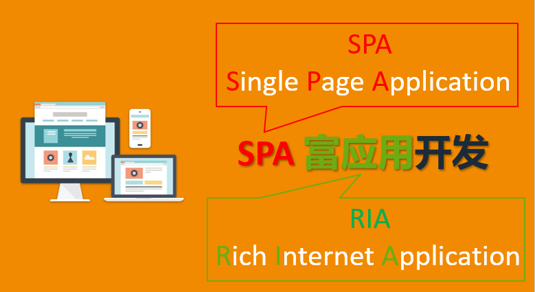
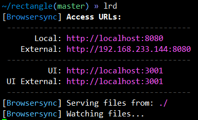

# SPA介绍

- 单页Web应用（single page web application，SPA），就是只有一张Web页面的应用，是加载单个HTML 页面并在用户与应用程序交互时动态更新该页面的Web应用程序。
- RIA:Rich Internet Application ,富网络应用。RIA是Rich Internet Applications的缩写，翻译成中文为富因特网应用程序（Macromedia中文网站翻译为Rich Internet应用程序）。

# 矩形计算器 v1.0

基本要求：

- 在 GitHub 上创建 rectangle 项目仓库
- 根据输入的矩形的长度和宽度计算矩形的周长和面积
- 使用 H5 内置控件实现
- 解决[浮点舍入误差](https://segmentfault.com/a/1190000013431163)的问题
- 不用考虑数据合法性校验
- 支持科学计数法的数据计算
- 将代码推送到 GitHub 的 rectangle 项目仓库
- 将代码通过 github pages 功能发布上线

[参考代码](https://github.com/lishuangg/rectangle)

# lrd（热加载）
- alias |grep lrd
    lrd="browser-sync start --server --port 8080 --no-open --files"

- External:访问网页的地址，加载的是真个目录
- URL：统一资源定位