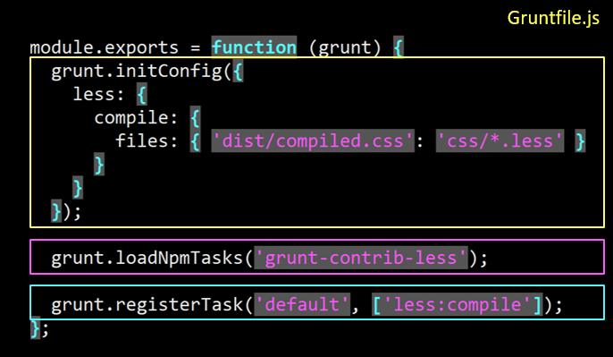
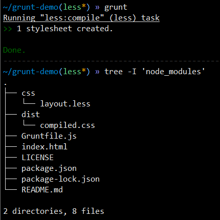

# 自动化构建--LESS 预处理


- 全局安装grunt

> npm i -g grunt

- 本地安装grunt以及相关插件


> npm i -D grunt grunt-contrib-less

- 自动化脚本文件 Gruntfile.js



> ```jsx
> module.exports = function (grunt) {
> //grunt.initConfig中包含的构建任务的配置信息（键值对表示），将源文件'css/*.less'构建成目标文件'dist/compiled.css'
>   grunt.initConfig({
>     less: {
>       compile: {
>         files: { 'dist/compiled.css': 'css/*.less' }
>       } 
>     }
>   });
> //loadNpmTasks方法的参数是自动化构建所需要引入的插件的名称，grunt-contrib-less是官方预处理的一个插件
>   grunt.loadNpmTasks('grunt-contrib-less');
> //定义自动化清单：grunt调用方法registerTask，第一个参数是自定义清单的名字，第二个参数是个字符串数组，包含的是清单里面每个任务的名称
>   grunt.registerTask('default', ['less:compile']);
> };
> ```

- 在grunt库中创建index.html文件和css文件中的layout.less文件

> ```jsx
> //layout.less文件  less文件可以实现代码重用，增加代码的可维护性
> .border-radius(@value) {//相当于一个函数，@value是变量
>   -webkit-border-radius: @value;
>   -moz-border-radius: @value;
>   border-radius: @value;
>  background-clip: padding-box;
> }
> .box-size(@color) {
>   width: 300px;
>   height: 100px;
>   background: @color;
>   border: 1px solid;
>   color: white;
> }
> .slightly-rounded {
>   .box-size(green);//调用
>   .border-radius(5px);
> }
> .very-rounded {
>   .box-size(blue);
>   .border-radius(16px);
> }
> @yellowish: #FFC;
> a{
>   background-color: @yellowish;
> }
> blockquote {
>   background-color: #333;
>   color: @yellowish;
> }
> ```

- 开始自动化构建 grunt

