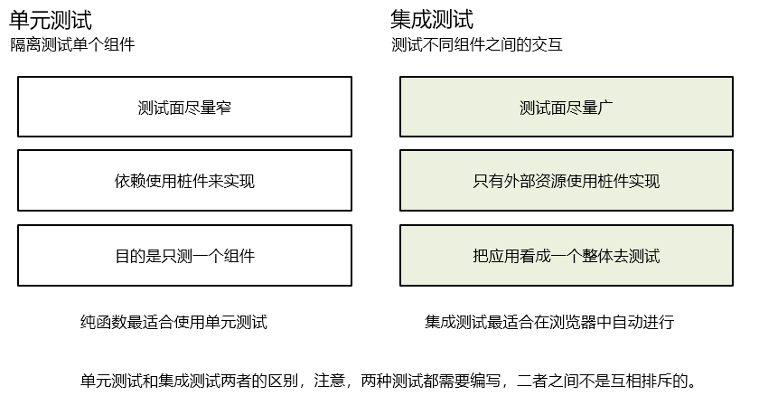
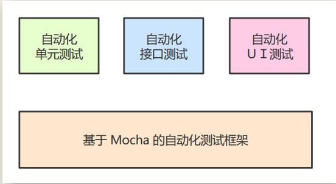

# 自动化构建--单元测试

- 参考资料

> 单元测试准则：https://github.com/yangyubo/zh-unit-testing-guidelines/blob/master/readme.rst
> 
> 编写可测试的 JavaScript 代码：http://blog.jobbole.com/67560/
JavaScript 与 QA 工程师（理论篇）：https://github.com/hubvue/nota/issues/26
> 
> 自动化、跨浏览器的 JavaScript 单元测试：https://www.zcfy.cc/article/learning-how-to-set-up-automated-cross-browser-javascript-unit-testing-mdash-philip-walton
> 
> Mocha 官网：https://mochajs.org/
> 
> Mocha 中文文档：https://segmentfault.com/a/1190000011362879
> 
> Chai 官网：https://www.chaijs.com/
> 
> Istanbul 官网：https://istanbul.js.org/
> 
> Istanbul 教程：http://www.ruanyifeng.com/blog/2015/06/istanbul.html
> 
> Sinon 官网：https://sinonjs.org/
> 
> Sinon 指南：https://www.zcfy.cc/article/sinon-tutorial-javascript-testing-with-mocks-spies-stubs-422.html

- 单元测试（unit testing），是指对软件中的最小可测试单元进行检查和验证。对于单元测试中单元的含义，一般指一个函数或者一个类里面的方法，单元就是人为规定的最小的被测功能模块。单元测试是在软件开发过程中要进行的最低级别的测试活动，软件的独立单元将在与程序的其他部分相隔离的情况下进行测试。

> BDD  行为驱动开发(先写程序代码在写测试代码)
> 
> TDD  测试驱动开发(先写测试代码在写程序代码)

### 注意

1. 经过了软件测试不能证明程序是没有错误的，因为不能进行完全的测试的。

2. 单元测试、集成测试、性能测试、上线测试等等，其中单元测试就是较早的测试行为，测试人员不会接触的测试方式。

3. 程序错误的三类：语法错误、逻辑错误、运行时错误

4. 评判一段程序的好坏有两种手段：证明、测试

    证明是利用数学手段、形式化的语言对程序进行形式化、符号化的逻辑推导。

    测试是输入特定的值执行特定的流程最终验证输出结果是否与预期值一致

5. 软件测试理论体系中，将软件测试分为两类：

    按是否执行被测程序，分为：静态测试和动态测试。静态测试不运行程序，动态测试需要运行被测程序。

    按是否查看程序代码，分为：黑盒测试和白盒测试。黑盒测试不需要查看被测程序的代码，而白盒测试需要查看程序代码。