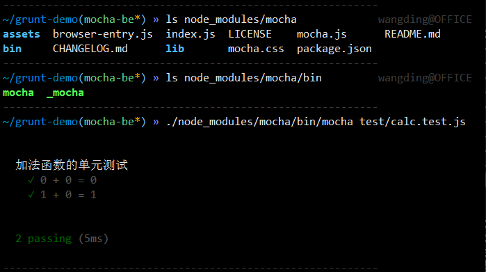
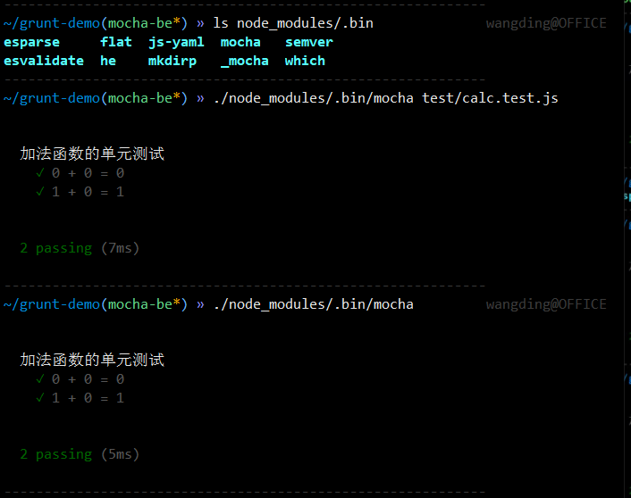
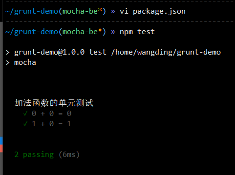
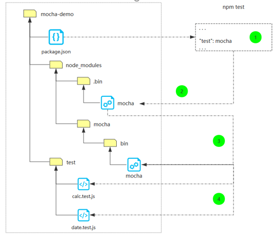
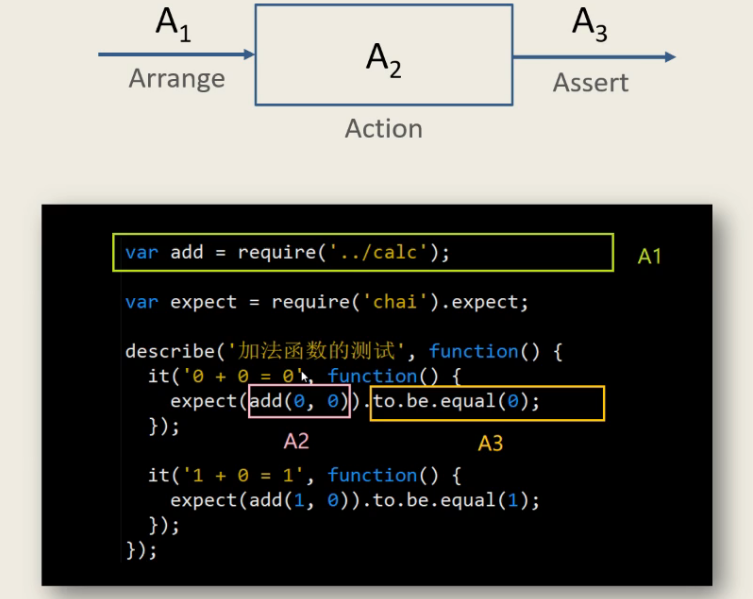
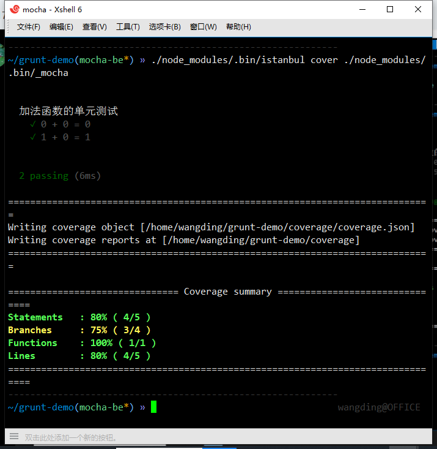
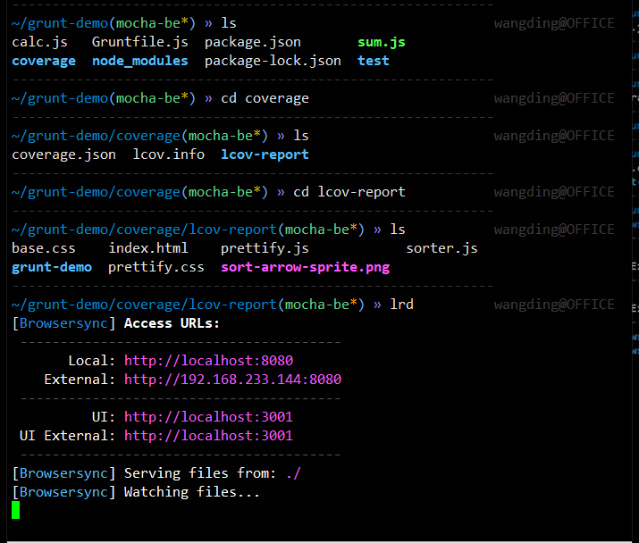
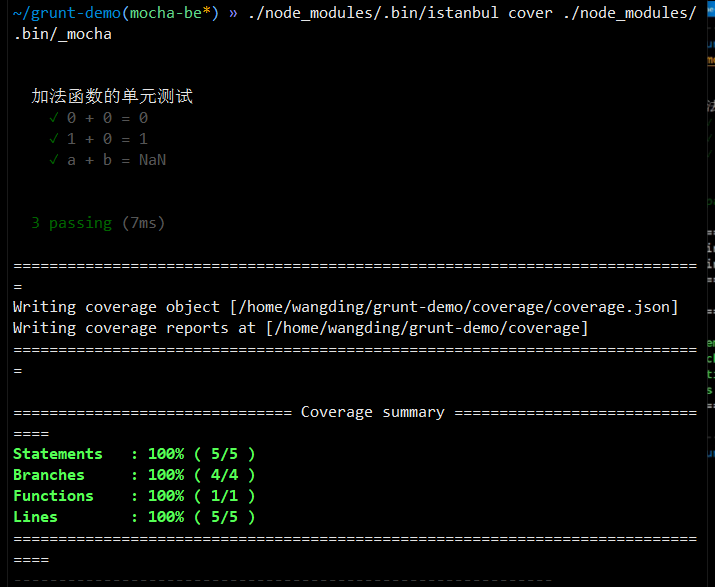

# 自动化构建--服务端代码单元测试

[grunt-mocha-cli插件文档](https://www.npmjs.com/package/grunt-mocha-cli)

[grunt-mocha-istanbul插件文档](https://www.npmjs.com/package/grunt-mocha-istanbul)

- 要求：

1. 在 grunt-demo 仓库，创建 mocha-be 分支

    > gco -b mocha-be

2. 创建被测模块 sum.js，被测模块暴露出 add 方法，实现 z = x + y

    > touch sum.js
    >
    > ```jsx
    > #!/usr/bin/node
    > 
    > if(process.argv.length != 4){
    >   console.log('sum x y');
    >   process.exit(1);
    > }
    > 
    > var x = Number(process.argv(2)),
    >     y = Number(process.argv(3));
    > 
    > const add = require('./calc.js');
    > console.log(`${x} + ${y} = ${add(x+y)}`);
    > ```

    > touch calc.js
    >
    > ```jsx
    > function add(x,y){
    >    if((typeof x ) === 'number' && (typeof y))
    >        return x + y;
    >    else
    >        return NaN;
    > }
    > module.exports = add;
    > ```

3. 对 sum.js 模块，编写 mocha 单元测试脚本

    安装插件并修改package.json文件
    > npm i -D mocha chai  (chai断言库)
    >
    > mkdir test
    >
    > touch test/calc.test.js

    > ```jsx
    > const add = require('../calc.js'),
    >       expect = require('chai').expect;
    > 
    > describe('加法函数的单元测试',function(){ //测试套件的描述，回调函数
    >   it('0 + 0 = 0',function(){
    >     expect(add(0,0)).to.be.equal(0);
    >   });//一个it();就是一个单元测试用例
    > 
    >   it('1 + 0 = 1',function(){
    >     expect(add(1,0)).to.be.equal(1);
    >   });
    > 
    >   it('a + b = NaN',function(){
    >     expect(isNaN(add('a','b'))).to.be.ok;
    >   })
    > });
    > ```

4. 执行 mocha 命令，运行单元测试，查看单元测试输出结果




修改package.json文件  "scripts:{"test":"mocha"},(这里的mocha就是./node_modules/.bin/mocha)



流程：



5. 进行代码覆盖率测试

    > npm i -D istanbul
    >
    > ls ./node_modules/.bin
    >
    > ./node_modules/.bin/istanbul cover ./node_modules/.bin/_mocha
    >
    > cover 子命令 覆盖
    >
    > istanbul启动程序./node_modules/.bin/_mocha并且收集信息



> 代码覆盖率：
> - 行覆盖率（line coverage）：是否每一行都执行了？
> - 函数覆盖率（function coverage）：是否每个函数都调用了？
> - 分支覆盖率（branch coverage）：是否每个if代码块都执行了？
> - 语句覆盖率（statement coverage）：是否每个语句都执行了？

6. 查看代码覆盖率报告




7. 添加 grunt 插件支持，实现 grunt mocha 单元测试

8. 添加 grunt 插件支持，实现 grunt 代码覆盖率测试

