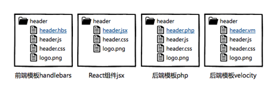
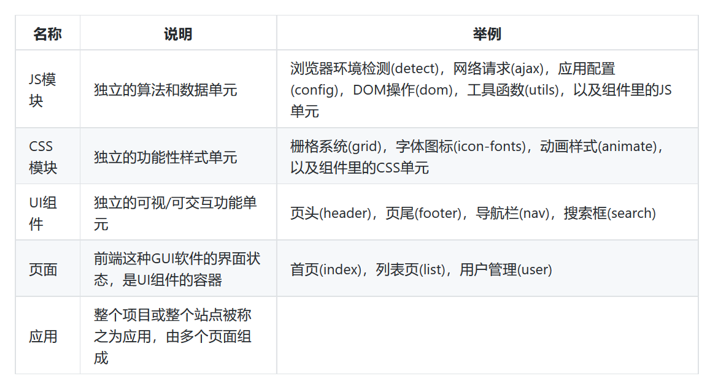
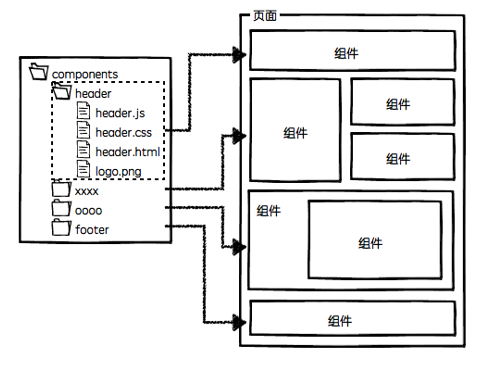
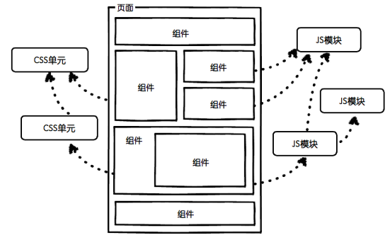
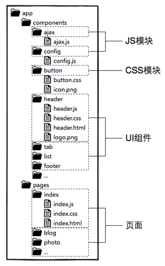

# 自定义UI组件

- 组件就是分而治之

> 页面上的每个 独立的 可视/可交互区域视为一个组件；
>
> 每个组件对应一个工程目录，组件所需的各种资源都在这个目录下就近维护；
> 
> 由于组件具有独立性，因此组件与组件之间可以 自由组合；
>
> 页面只不过是组件的容器，负责组合组件形成功能完整的界面；
>
> 当不需要某个组件，或者想要替换组件时，可以整个目录删除/替换。

- 组件化开发具有较高的通用性，无论是前端渲染的单页面应用，还是后端模板渲染的多页面应用，组件化开发的概念都能适用。组件HTML部分根据业务选型的不同，可以是静态的HTML文件，可以是前端模板，也可以是后端模板。

组件可组合，组件的JS可依赖其他JS模块，CSS可依赖其他CSS单元

